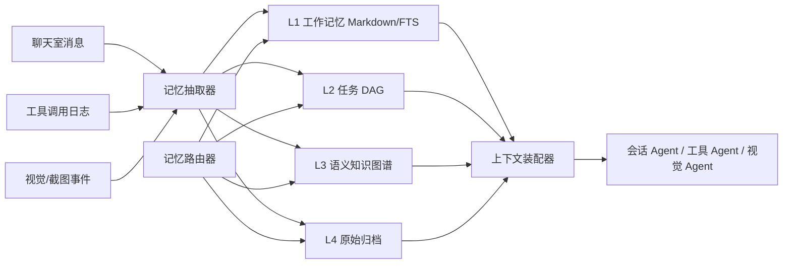

# 2026-05-02 分层记忆管理 Code Agent 可行性方案与验收准则

## 输入报告评估

用户提供的《分层记忆管理 Code Agent 技术方案评估与选型报告》对 Codex CLI、Claude Code、Cursor、Cline Memory Bank、Beads、MemoryGraph、Factory AI 和 RSCB-MC 的比较方向是可行的。对当前 COOLZHU AGENT 项目最有价值的结论是：

- 记忆系统不应只追求压缩率，而应保证任务连续性。
- 长期记忆需要分层，不能把完整对话历史直接塞回上下文。
- Beads 的任务 DAG 更适合任务执行和多 Agent 协作。
- MemoryGraph/向量检索更适合代码知识、因果关系和历史修复查询。
- Codex 式异步记忆流水线适合作为会话结束后的后台巩固机制。
- Cline 风格 Markdown 文档适合做可审查、可版本化的显性记忆。

## 当前项目适配判断

COOLZHU AGENT 的目标是“让普通用户更傻瓜式地使用 AI 完成电脑工作”。因此记忆系统不能只服务代码问答，还需要覆盖：

- 会话人格和用户偏好。
- 单次任务的目标、步骤、阻塞和完成证据。
- 工具调用历史、失败模式、可复用参数。
- 视觉识别和桌面操作经验。
- 多 Agent 协作中的任务队列、依赖和归属。

## 推荐架构

采用四层记忆，而不是单一三层：

| 层级 | 名称 | 内容 | 存储建议 | 注入策略 |
| --- | --- | --- | --- | --- |
| L0 | 会话短期上下文 | 当前聊天室最近消息、当前任务草稿、待确认事项 | 内存 + SQLite session 表 | 每轮直接注入，按 token 截断 |
| L1 | 显性工作记忆 | 会话摘要、用户偏好、工程规则、当前任务状态 | Markdown + SQLite FTS5 | 启动会话时加载摘要 |
| L2 | 任务/工具结构记忆 | Beads 风格任务 DAG、工具调用队列、依赖、阻塞关系 | SQLite/Dolt 可选，先 SQLite | 任务规划和多 Agent 调度时检索 |
| L3 | 语义知识记忆 | 代码实体、修复原因、模块关系、视觉锚点经验 | SQLite + 向量索引 + 关系表 | 语义命中后注入 Top-K 摘要 |
| L4 | 原始归档 | 完整对话、附件、截图索引、工具日志 | 文件系统 + SQLite metadata | 仅审计/回溯时读取 |

## 三类核心记忆

| 类型 | 定义 | 示例 | 生命周期 |
| --- | --- | --- | --- |
| Person Memory | 用户偏好、项目目标、交互习惯、默认模型配置 | “用户希望 GUI 尽量接近复古像素设计图” | 长期，需可编辑 |
| Task Memory | 单个任务的目标、计划、状态、依赖、验收证据 | “桌宠失焦标题栏问题已通过 NOACTIVATE 修复” | 中期，任务完成后归档 |
| Tool Memory | 工具能力、失败原因、参数经验、回归命令 | “Gerrit external-id 文件不能带 PowerShell UTF-8 BOM” | 长期，按工具归类 |

## 数据模型草案

## 实施阶段

### Phase 1：最小可用记忆

目标：先让会话可恢复、任务可追踪。

- 新增 `memory-service` 包或在 `core-runtime` 下新增 `memory` 子模块。
- SQLite 表：`sessions`、`messages`、`memory_items`、`tasks`、`tool_events`。
- 每个会话保存 `session_name + model_name + provider_ref`。
- 对话窗口加载历史消息时分页加载，避免一次性渲染大量内容。
- 会话删除时软删除，保留可选审计归档。

验收：

- 重启程序后可打开最近 10 个会话。
- 打开会话后能恢复历史对话。
- 单会话 1000 条消息时，首屏加载时间小于 1 秒。
- 删除/重命名会话后，发送目标下拉框同步刷新。

### Phase 2：任务 DAG 与工具记忆

目标：把“会话即 Agent，多 Agent 协同”落到结构化任务。

- 设计 `task_nodes`：`id`、`owner_agent_id`、`title`、`status`、`depends_on`、`timeout_ms`。
- 工具 Agent 执行任务时写入 `tool_events`。
- 聊天室中以 task checklist 显示排队、执行、完成、失败。
- 工具 Agent 完成后用 `@agent_name` 回写对应会话。

验收：

- 同时向多个 Agent 群发任务时，工具队列状态可见。
- 同一工具一次只执行一个互斥任务，其它任务显示等待。
- 超时任务自动标记失败并释放队列。
- 工具失败原因进入 Tool Memory，可被后续检索。

### Phase 3：语义检索与知识图谱

目标：支持“上次怎么修的”“哪个模块负责”等历史语义查询。

- 本地 embedding 优先，避免会话/代码隐私出云。
- 建立实体类型：模块、文件、接口、工具、错误、修复、决策、视觉锚点。
- 建立关系类型：`fixes`、`depends_on`、`calls`、`configured_by`、`observed_in`、`validated_by`。
- 检索结果必须带来源：会话 ID、消息 ID、commit ID、日志路径。

验收：

- 能回答“桌宠标题栏问题如何解决”并引用对应工作日志/commit。
- 能回答“computer-use 当前有哪些风险点”并列出来源。
- 语义检索 Top-5 命中人工期望结果的比例不低于 80%。
- 单次记忆注入默认不超过 5000 tokens。

### Phase 4：记忆安全与治理

目标：避免错误记忆污染 Agent。

- 增加置信度、来源、时间衰减和人工确认字段。
- 将未经验证的模型推理标记为 `hypothesis`，不得作为事实直接注入。
- 对 API Key、路径、截图、个人信息做敏感字段标记。
- 增加记忆编辑 UI：查看、禁用、删除、固定、导出。

验收：

- 未验证记忆不会进入高优先级上下文。
- 删除会话时可选择删除或保留归档记忆。
- 敏感字段不会被发送给远端模型，除非用户显式允许。
- 记忆检索日志可审计。

## 和当前模块的接口建议

| 调用方 | 接口 | 说明 |
| --- | --- | --- |
| `gui-web` | `GET /api/sessions` | 返回最多 10 个会话 |
| `gui-web` | `GET /api/sessions/{id}/messages?cursor=` | 分页加载消息 |
| `gui-web` | `POST /api/chat/send` | 增加 `target_agent_ids` 和 `selected_message_ids` |
| `core-runtime` | `MemoryStore::append_message` | 写入消息和附件元数据 |
| `core-runtime` | `MemoryRouter::retrieve` | 根据意图检索 L1/L2/L3 |
| `tooling` | `ToolMemory::record_event` | 记录工具状态、耗时、失败原因 |
| `computer-use` | `VisualOperationMemory::record_anchor` | 记录视觉锚点和操作结果 |

## 首批验收用例

| 用例 | 步骤 | 预期 |
| --- | --- | --- |
| 会话恢复 | 创建会话、发送 20 条消息、重启、重新打开 | 历史消息完整恢复 |
| 大会话加载 | 导入 1000 条历史消息 | 首屏快速显示，滚动分页加载 |
| Agent 群发 | 选择 3 个普通 Agent 发送同一任务 | 3 个会话分别收到任务 |
| 工具队列 | 2 个 Agent 同时调用工具 Agent | 一个执行，一个等待 |
| 工具记忆复用 | 制造一次工具失败，再问失败原因 | 能引用 Tool Memory |
| 历史修复查询 | 询问“桌宠标题栏问题怎么修的” | 能返回 NOACTIVATE、TOOLWINDOW、透明刷新层等要点 |
| 安全过滤 | 消息包含 API Key | 记忆归档打敏感标记，默认不注入远端模型 |

## 结论

推荐优先实现 SQLite + Markdown + 任务 DAG 的最小闭环，不急于直接引入复杂图数据库。等会话、任务、工具三类记忆跑通后，再引入本地 embedding 和知识图谱。这样既能快速支撑当前 GUI、多 Agent 和 computer-use 调试，也能保持后续向 Beads/MemoryGraph 架构演进的接口空间。
