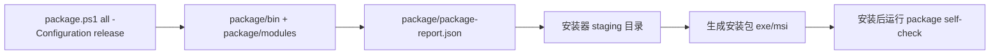

# 基于 package 解耦架构的安装包实施方案（2026-06-19）

## 目标

把当前已经解耦的 `package/` 汇总目录转换为 Windows 安装包，安装后能从桌面/开始菜单启动，并复用现有模块化编译、备份、自检和日志体系。

## 推荐路线

第一阶段先做“骨架安装包”：

- 安装 `package/bin/*.exe`。
- 安装 `package/modules/**` 资源。
- 安装 `package/run.ps1` 或生成等价启动器。
- 首次启动写入/迁移 `coolzhu.toml`。
- 不内置大模型、llama.cpp 大包、视觉权重；这些走首启向导或手动放置。

第二阶段再做“离线完整版”：

- 额外包含 llama.cpp runtime、模型、embedding、视觉权重。
- 由于体积可能达到 GB 级，必须单独产物，不影响骨架安装包。

## 构建流水线



## 目录规划

安装目录建议：

```text
%ProgramFiles%\CoolzhuAgent\
  bin\
  modules\
  run.ps1
  package-report.json
```

用户数据目录建议：

```text
%LOCALAPPDATA%\CoolzhuAgent\
  logs\
  models\
  downloads\
  selfcheck-last.json
```

工作区继续使用用户选择的 workspace；安装器不得覆盖已有 `coolzhu.toml`。

## 安装器技术选型

优先方案：先用外部安装器脚本包装 `package/`。

- 优点：与当前 decoupled package 目录直接对接，风险小。
- 适合：快速出可安装 `.exe`，验证安装/卸载/桌面快捷方式。
- 约束：需要单独维护安装脚本。

备选方案：后续再接 Tauri bundler / MSI。

- 优点：与 Tauri 生态集成更深。
- 风险：当前项目已经由多个模块二进制和资源目录组成，直接 sidecar 化会牵动生命周期和路径解析。

## 安装后启动策略

安装器创建快捷方式，目标指向：

```powershell
powershell.exe -NoProfile -ExecutionPolicy Bypass -File "%ProgramFiles%\CoolzhuAgent\run.ps1" app -HealthTimeoutSeconds 60
```

后续可替换为原生启动器 `coolzhu-launcher.exe`，减少 PowerShell 依赖；但第一阶段保留 PowerShell 更利于调试日志。

启动后必须生成：

- `<user-log-dir>\package-selfcheck-last.json`
- `<user-log-dir>\coolzhu-web-console.stdout.log`
- `<user-log-dir>\coolzhu-web-console.stderr.log`
- `<user-log-dir>\coolzhu-tauri-shell.stdout.log`
- `<user-log-dir>\coolzhu-tauri-shell.stderr.log`

## 首启向导

骨架安装包不下载 GB 级内容。首启向导需要支持：

- 检测 GPU / CUDA / 可用显存。
- 检测本地模型、embedding、视觉权重是否已存在。
- 给出手动下载地址和放置路径。
- 下载慢或文件较大时提示用户手动下载。
- 下载完成后校验 SHA-256。
- 写入 `coolzhu.toml`，不覆盖用户已有配置。

## 验收清单

P1 骨架安装包完成标准：

- `package.ps1 all -Configuration release` 成功。
- 安装器能安装到测试目录。
- 桌面快捷方式能启动 app。
- web-console health HTTP 200。
- `package-selfcheck-last.json` 生成且无 error。
- 卸载后安装目录清理干净，用户 workspace 和模型目录不被删除。

P2 首启向导完成标准：

- 无模型时显示下载/手动放置引导。
- 已手动放置模型时跳过下载。
- 网络失败时给出可恢复错误，不阻塞查看基础 UI。

## 风险与回滚

- 安装路径与 workspace 路径必须分离，卸载不得删除用户数据。
- 模型/视觉权重体积大，不能塞进默认安装包。
- 无签名安装包会触发 Windows SmartScreen，测试版需明确提示。
- `package/run.ps1` 当前依赖 PowerShell；若企业环境禁用脚本，需提前切换到原生 launcher。
- 任意 installer 修改前先备份 `package/`、安装脚本和 `config/package-manifest.json` 到 `tmp/backups/<timestamp>-installer-pre/`。
