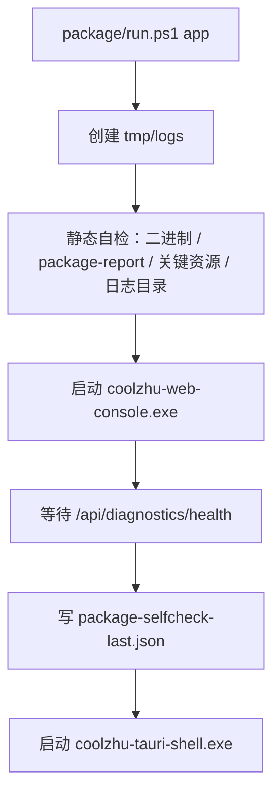

# package 模块日志与启动自检落地方案（2026-06-19）

## 当前落地点

本轮已经在 `package/run.ps1` 落地第一阶段启动自检：

- 启动入口创建 `tmp/logs/`。
- 长驻模块 stdout/stderr 重定向到：
  - `tmp/logs/coolzhu-web-console.stdout.log`
  - `tmp/logs/coolzhu-web-console.stderr.log`
  - `tmp/logs/coolzhu-tauri-shell.stdout.log`
  - `tmp/logs/coolzhu-tauri-shell.stderr.log`
- 启动时写入：
  - `tmp/logs/package-selfcheck-last.json`
  - `tmp/logs/package-selfcheck-<timestamp>.json`
- `app` 模式先做 package 静态自检，再启动 web-console，等待 `/api/diagnostics/health`，随后把 health 摘要写回 self-check 报告，再启动 Tauri shell。

当前 self-check 覆盖：

- `package/package-report.json`
- `package/bin` 下 7 个模块二进制
- Tauri 桌宠关键 UI 资源 `pet-mini.html`
- 桌宠 blink 关键帧 `blink-0.png`
- `tmp/logs` 可写性
- web-console health 摘要

## 启动流程



## 报告结构

```json
{
  "generated_at": "2026-06-19T02:04:50.0710605Z",
  "component": "app",
  "package_root": "C:\\Users\\zhupu\\Desktop\\codex\\package",
  "log_root": "C:\\Users\\zhupu\\Desktop\\codex\\tmp\\logs",
  "overall": "ok",
  "summary": { "ok": 12, "warn": 0, "error": 0 },
  "checks": [
    { "id": "package.log_dir", "status": "ok", "detail": "..." },
    { "id": "web-console.health", "status": "ok", "detail": "...", "summary": { "status": "warn" } }
  ]
}
```

`status` 只允许：

- `ok`：可直接启动。
- `warn`：允许启动，但 UI 诊断页必须提示用户。
- `error`：安装器或启动器应阻断主流程，给出修复动作。

## 下一阶段模块 probe

| 模块 | Probe | 错误等级 | 落地位置 |
|---|---|---:|---|
| gui-web | config 解析、session store、SQLite 可写、health/audit 状态 | P0/P1 | web-console 启动后 |
| gui-desktop | WebView2、web-console URL、桌宠资源、托盘/窗口创建 | P0/P1 | tauri-shell setup |
| computer-use | preflight check、输入后端、安全门禁状态 | P1/P2 | `coolzhu-computer-use-check.exe` |
| vision | `vision-smoke`、local-vlm/UIDETR 资源存在、模型服务可达 | P1/P2 | vision smoke 二进制 |
| llm-adapter | provider URL、OpenAI-compatible schema、credential 缺失、非 2xx | P1 | web-console/provider 初始化 |
| cli/core-runtime | config root、workspace、MCP registry、sandbox/command spawn | P1 | CLI 和 runtime 初始化 |

## 日志规范

结构化 err 日志最低字段：

```json
{
  "event": "module.action.error",
  "module": "gui-web",
  "level": "error",
  "err_kind": "io",
  "message": "failed to write session store",
  "code_site": "web-console/src/main.rs:1234",
  "trace_id": "..."
}
```

短期继续复用现有 `coolzhu-diagnostics` JSONL。`package/run.ps1` 设置 `COOLZHU_LOG_DIR=tmp/logs` 是历史 diagnostics 的 one-shot 兼容入口，不作为新增业务配置；后续应把日志目录迁移到 `coolzhu.toml` 的 typed 配置。

## 验收命令

所有命令外层必须设置超时，输出写入 `tmp/logs/`：

```powershell
powershell -NoProfile -ExecutionPolicy Bypass -File package/run.ps1 app -HealthTimeoutSeconds 60
Invoke-WebRequest http://127.0.0.1:8765/api/diagnostics/health -UseBasicParsing
Get-Content tmp/logs/package-selfcheck-last.json -Raw | ConvertFrom-Json
```

当前验证结果：`package-selfcheck-last.json` 为 `overall=ok`，12 项 `ok`，0 `warn`，0 `error`；web-console health HTTP 200，health summary 为 `warn`（10 ok / 1 warn / 0 error）。
