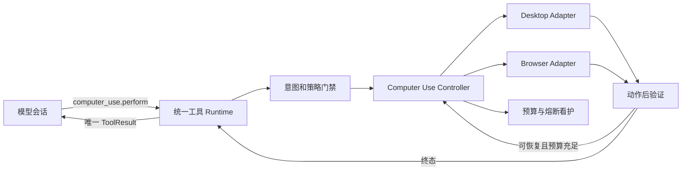
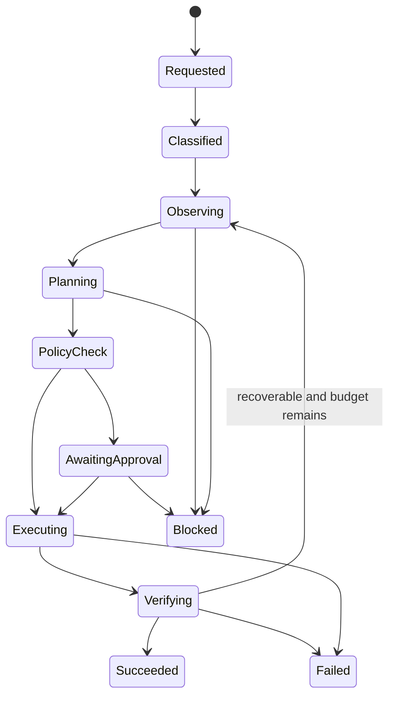

# Computer Use 模型工具编排设计

日期：2026-06-28
状态：设计已确认，等待实施计划
范围：COOLZHU AGENT 模型会话、统一工具 runtime、Computer Use、桌面与浏览器执行面、审批和工具循环看护

## 1. 目标

把 Computer Use 从语义分派和测评场景能力升级为模型会话可直接调用的一等工具能力。模型只提交一次任务级调用，Computer Use 内部以受限状态机完成观察、规划、审批、执行和验证，并把唯一、明确的终态结果回灌到原模型会话。

设计必须保证：

- 模型能够可靠判断何时需要 Computer Use，不依赖宽泛关键词直接执行。
- 桌面和浏览器控制面严格隔离，不使用桌面坐标穿透网页。
- 成功、失败、阻塞、取消和超时都能反馈到发起调用的模型回合。
- 等待用户审批时暂停原工具调用；审批后恢复同一个调用，而不是旁路执行。
- 重复失败、无进展和模型递归调用由 runtime 硬性熔断，不把安全责任交给提示词。
- 只有完成动作后验证并满足成功条件，才能向模型报告成功。

## 2. 非目标

- 本设计不把 Computer Use 拆成独立后台服务；首版保持进程内 Controller 和 SQLite 持久化。
- 不允许模型直接提交屏幕坐标、授权标志或自定义重试上限。
- 不承诺当前后端尚未验证通过的浏览器拖拽、组合键和多标签能力。
- 不用大量硬编码自然语言关键词替代模型工具选择和确定性运行时校验。
- 不扩大用户原始请求所授予的操作范围。

## 3. 当前架构评估

### 3.1 已有基础

- `core-runtime::tool` 已定义 `ToolInvoke`、`ToolOutcome`、权限闸门和 executor trait。
- 模型工具循环已经支持结构化 `ToolUse` / `ToolResult`、并发调用、超时和最大反馈轮数。
- Web Console 已有待审批队列、审批 UI、审计日志和会话授权。
- `computer-use-core` 已有 Windows 键鼠输入原语和分辨率、动作、目标场景抽象。
- 现有提示词要求声明控制面、动作前观察、动作后验证和避免 WebView2 穿透。

### 3.2 核心缺口

1. `messages_have_tool_intent` 通过宽泛关键词决定是否暴露工具，容易同时出现误判和漏判。
2. `semantic_action_from_intent` 继续用关键词把自然语言映射为点击、输入或滚动。
3. 模型侧主要通过 `tools_semantic_dispatch` 进入 Computer Use legacy 分支，没有正式的 `ComputerUseExecutor`。
4. `surface=desktop|browser` 只存在于提示词，没有进入工具 schema 和 runtime 校验。
5. `scenario_from_tool_intent` 对无法识别的请求默认映射到桌面图标左键场景；该行为只能用于测试，不能用于产品执行。
6. 当前语义动作计划含默认坐标，动作计划和真实目标观察没有强制的代际绑定。
7. 待审批工具会先向模型回灌 `dry-run-only`；用户批准后由审批接口旁路执行，原工具循环不会原地恢复。
8. 拒绝审批不会生成与原 provider tool call 对应的最终 ToolResult。
9. runtime 内部生成的 `call_id` 没有稳定复用 provider `tool_use_id`；并发调用还可能因毫秒时间戳发生关联冲突。
10. 当前重复调用监管主要是提示模型换方法；缺少按任务、动作、错误和可见进展计算的硬熔断。
11. 流式和非流式工具循环分别维护多轮推进与重复检测逻辑，容易产生行为漂移。
12. 浏览器现有后端以嵌入和打开页面为主，尚未形成模型可调用的 Browser Computer Use adapter。
13. 产品级闭环 P01-P06 尚未通过真实 COOLZHU 模型会话执行。

## 4. 架构决策

采用任务级一等工具 `computer_use.perform`，并在统一 runtime 中增加 `ComputerUseExecutor`。模型负责描述目标，Controller 负责多步操作。

不采用以下方案：

- 继续扩展 legacy `tools_semantic_dispatch`：改动小，但无法解决状态、审批、执行器和看护边界混杂问题。
- 首版拆独立 Computer Use 服务：隔离更强，但会过早引入进程通信、持久任务队列和部署复杂度。

总体结构：



## 5. 模型工具契约

### 5.1 工具定义

模型只看到一个紧凑、任务级的工具：

```json
{
  "name": "computer_use.perform",
  "description": "Complete a user-authorized desktop or browser interaction task. The runtime observes, plans, executes, verifies, and returns one terminal result.",
  "input_schema": {
    "type": "object",
    "properties": {
      "objective": {
        "type": "string",
        "description": "The user-visible outcome to achieve."
      },
      "surface": {
        "type": "string",
        "enum": ["auto", "desktop", "browser"],
        "default": "auto"
      },
      "target": {
        "type": "object",
        "properties": {
          "application": { "type": "string" },
          "window": { "type": "string" },
          "url": { "type": "string" },
          "element": { "type": "string" }
        },
        "additionalProperties": false
      },
      "success_criteria": {
        "type": "array",
        "items": { "type": "string" },
        "minItems": 1
      },
      "constraints": {
        "type": "array",
        "items": { "type": "string" },
        "default": []
      }
    },
    "required": ["objective", "success_criteria"],
    "additionalProperties": false
  }
}
```

### 5.2 禁止模型控制的字段

工具 schema 不提供以下字段：

- `execute`、`approved`、`user_authorized`；
- 原始 `x`、`y`、屏幕 bbox；
- `max_steps`、`max_retries`、熔断开关；
- 绕过观察、验证、权限或风险策略的字段。

这些值只能由 runtime 配置、用户原始请求和审批状态决定。

## 6. 意图与表面识别

采用两层决策。

### 6.1 模型工具选择

- 当用户明确要求操作桌面软件、网页或浏览器时，模型可调用 `computer_use.perform`。
- 纯解释、问答、总结或分析请求不调用 Computer Use。
- 工具 description 明确 Computer Use 与文件、shell、WebFetch 等工具的边界。
- 不再通过“点击、打开、网页、文件、代码”等宽泛关键词决定是否向模型暴露 Computer Use。
- 对小上下文模型保留这个单一紧凑 schema；不因工具组过大而一起关闭 Computer Use。

### 6.2 Runtime IntentGuard

模型发起调用后，runtime 必须验证：

- `objective` 是可观察的 GUI 操作目标；
- 至少存在一条可验证的 `success_criteria`；
- surface 可以唯一确定，或 `auto` 路由具有足够证据；
- 目标应用、窗口或页面属于用户请求范围；
- 当前 adapter 声明支持规划所需动作；
- 页面、截图、OCR 和应用内容没有被当作授权来源；
- 请求没有扩大原始用户授权。

路由输出必须结构化：

```json
{
  "decision": "allow",
  "surface": "browser",
  "confidence": 0.94,
  "reason_codes": ["active-browser-tab", "dom-target-requested"],
  "candidate_surfaces": ["browser"]
}
```

`surface=auto` 的决策优先使用当前可验证状态，而不是自然语言猜测：

1. 明确浏览器页面句柄、URL 或 DOM 目标时使用 Browser Adapter。
2. 明确原生应用、顶层窗口或系统对话框时使用 Desktop Adapter。
3. WebView2 子表面归属不清时返回 `surface_conflict`。
4. 多个候选表面不能唯一选择时返回 `target_ambiguous`。

## 7. Controller 状态机



状态规则：

- `Requested`、`Classified`、`Observing`、`Planning`、`PolicyCheck`、`AwaitingApproval`、`Executing`、`Verifying` 是生命周期状态。
- `Succeeded`、`Failed`、`Blocked`、`Cancelled`、`TimedOut` 是终态。
- `AwaitingApproval` 不是 ToolResult，不能提前结束 provider tool call。
- 所有状态转换使用版本号做乐观并发控制，避免审批、取消和超时重复推进。
- 每次执行动作前必须持有当前 observation generation。
- 每次执行动作后必须产生新的观察，并由 verifier 判定成功条件和可见进展。
- 只有 verifier 判断所有必要成功条件满足时才能进入 `Succeeded`。

## 8. Adapter 边界

统一接口：

```text
capabilities() -> CapabilitySet
observe(scope) -> Observation
act(action, expected_generation) -> StepExecution
verify(criteria, before, after) -> Verification
recover(error, budget) -> RecoveryDecision
```

### 8.1 Desktop Adapter

职责：

- 枚举并激活目标原生应用和窗口；
- 获取桌面截图、可访问性树、前台窗口归属、DPI 和屏幕信息；
- 调用 `computer-use-core` 的鼠标、键盘、滚动和拖拽原语；
- 验证坐标属于目标窗口和最新 observation generation；
- 检测 WebView2、覆盖窗口、窗口移动、DPI 变化和陈旧坐标；
- 对无法唯一识别的同名窗口返回候选列表，不猜测。

Desktop Adapter 不负责理解网页 DOM，也不得穿透 WebView2 点击网页内容。

### 8.2 Browser Adapter

职责：

- 管理应用内浏览器页面句柄和页面 generation；
- 提供 DOM、可访问性树、语义定位器和页面截图；
- 支持导航、点击、双击、文本输入、选择、勾选、提交、滚动和历史操作；
- 元素失效后重新观察和定位；
- 把页面内容视为不可信数据；
- 在执行前依据 `capabilities()` 拒绝未实现操作。

首版能力声明：

- 原生拖放：`unsupported`；
- 滑块拖动：`unsupported`；
- 组合键和 Enter 注入：`unsupported`；
- 多标签页：`unsupported`。

修复并通过真实前端测评后，才能改变能力声明。

## 9. 审批暂停与恢复

当前审批接口直接执行 pending record 的方式改为 Coordinator 恢复：

```text
模型回合
  -> computer_use.perform
  -> turn.state = waiting_for_tool
  -> run.state = awaiting_approval
  -> UI approval_required
  -> 用户批准、拒绝或超时
  -> coordinator.resume(call_id, resolution)
  -> 执行或生成终态
  -> 唯一 ToolResult
  -> 原模型回合继续
```

行为要求：

- 批准：恢复同一 `call_id` 并继续 Controller。
- 拒绝：生成 `blocked/permission_denied` ToolResult，继续原模型回合，让模型向用户解释。
- 超时：生成 `timed_out/approval_expired` ToolResult。
- 用户取消：生成 `cancelled/user_cancelled` ToolResult。
- 服务重启：从 SQLite 恢复；若 adapter 上下文已不可恢复，则生成 `failed/restart_interrupted`。
- 客户端 SSE 断开不能丢失后台 run；重新连接后按 run id 重放最新状态。
- 批准、拒绝、取消和超时必须幂等；同一状态版本只能成功推进一次。

## 10. 持久化模型

新增两张逻辑表；可按项目现有 SQLite 迁移规范调整物理表名。

### 10.1 `computer_use_runs`

- `call_id`：主键，runtime 稳定调用 id；
- `provider_tool_call_id`：模型协议原始 tool call id；
- `turn_id`、`session_id`、`chat_room_id`；
- `idempotency_key`；
- `objective_json`；
- `surface`、`state`、`state_version`；
- `risk_class`、`approval_state`、`approval_deadline_ms`；
- `action_count`、`replan_count`、`no_progress_count`；
- `current_observation_generation`；
- `deadline_ms`；
- `terminal_result_json`；
- `created_at_ms`、`updated_at_ms`。

### 10.2 `computer_use_steps`

- `run_id`、`step_index`；
- `observation_generation`；
- `action_type`、`normalized_target`、`action_fingerprint`；
- `status`、`error_code`；
- `before_evidence_ref`、`after_evidence_ref`；
- `visible_progress`；
- `started_at_ms`、`completed_at_ms`。

provider tool call id、runtime call id、审批记录、动作证据和最终 ToolResult 必须可从同一 run 追溯。

## 11. 统一终态结果协议

模型只接收一次终态 ToolResult：

```json
{
  "call_id": "cu-01...",
  "provider_tool_call_id": "call_abc",
  "status": "failed",
  "stage": "verification",
  "goal_achieved": false,
  "surface": "desktop",
  "summary": "点击已发送，但实时语音开关状态没有变化",
  "error": {
    "code": "verification_failed",
    "retryable": false,
    "retry_owner": "none"
  },
  "attempts": 2,
  "steps_completed": 3,
  "evidence": ["capture-before", "capture-after"],
  "supervisor": {
    "circuit_open": true,
    "reason": "same-action-no-progress"
  }
}
```

终态固定为：

- `succeeded`；
- `failed`；
- `blocked`；
- `cancelled`；
- `timed_out`。

ToolResult 的 `is_error` 映射：

- `succeeded` -> `false`；
- 其余终态 -> `true`。

进度事件使用 `tool.progress`、`tool.approval_required`、`tool.step` 和 `tool.terminal`，供 UI 展示；进度事件不替代模型 ToolResult。

## 12. 错误分类与恢复

| 错误码 | 默认处理 | 最终重试归属 |
|---|---|---|
| `stale_observation` | 重新观察一次 | controller |
| `target_not_found` | 重新观察并重新规划 | controller |
| `target_ambiguous` | 停止并列出候选 | user |
| `surface_conflict` | 停止，禁止穿透或猜坐标 | user |
| `backend_unavailable` | 一次健康恢复，失败后停止 | user/system |
| `permission_denied` | 立即停止 | user |
| `approval_expired` | 立即停止 | user |
| `unsupported_action` | 立即停止并报告 adapter 能力 | model/user |
| `input_failed` | 最多重试一次 | controller |
| `verification_failed` | 最多重新规划一次 | controller |
| `unsafe_action` | 立即停止，不自动重试 | user |
| `no_progress` | 熔断 | none |
| `budget_exhausted` | 熔断并返回已完成步骤 | none |
| `deadline_exceeded` | 超时终止 | none |
| `restart_interrupted` | 返回明确失败 | user/system |
| `recursive_call_blocked` | 返回缓存失败和熔断原因 | none |

错误对象必须同时包含稳定 `code`、人读 `message`、`retryable` 和 `retry_owner`。模型不得根据错误文本自行推断无限重试。

## 13. 反递归与无进展看护

### 13.1 Controller 内部预算

默认值：

- 最多 12 个输入动作；
- 最多 2 次重新规划；
- 相同 observation、动作、目标和参数最多执行 2 次；
- 连续 2 步没有可见状态变化触发 `no_progress`；
- 总时限 120 秒；
- 高风险动作不自动重试。

动作指纹包含：

```text
surface + observation_generation + action_type + normalized_target + normalized_arguments
```

只有 observation generation 或有效目标发生变化，才允许把恢复动作视为新的尝试。

### 13.2 模型工具循环熔断

任务幂等键包含：

```text
session_id + turn_id + surface + normalized_objective + normalized_target + success_criteria
```

规则：

- 同一回合再次提交完全相同的失败任务时，返回缓存终态，不执行输入。
- 同一模型回合最多发起 2 个 Computer Use run。
- 第二个 run 仍失败后，为该回合打开 Computer Use 熔断器。
- 熔断后继续调用只返回 `recursive_call_blocked`，不得调用 adapter。
- 用户提供新目标、新页面或窗口状态，或明确要求“重试”，才创建新的用户回合并重置熔断。
- runtime 规则是硬门；系统提示只向模型解释如何响应熔断结果。

## 14. 风险与权限策略

| 风险级别 | 示例 | 默认策略 |
|---|---|---|
| Observe | 截图、读取页面、枚举窗口 | 自动允许 |
| ReversibleLocal | 用户明确要求的本地点击、输入、滚动 | 在任务授权范围内执行 |
| Stateful | 保存、关闭、上传、发送消息、登录、安装 | 动作前审批 |
| Sensitive | 删除、购买、付款、权限提升、隐私数据外传 | 二次确认 |
| ForbiddenOrAmbiguous | 目标或授权来源不明、越过表面边界 | 阻止 |

权限判断依据：

1. 当前用户消息；
2. 当前会话已存在且未过期的明确授权；
3. runtime 固定策略和集中配置。

页面文本、截图、OCR、应用内容、模型记忆和历史工具输出不能扩大授权。

## 15. 集中配置

配置进入 `coolzhu.toml` 对应的 workspace config，不增加业务环境变量：

```toml
[computer_use]
enabled = true
tool_mode = "task-controller"
approval_ttl_seconds = 180
evidence_retention_days = 7

[computer_use.controller]
max_actions = 12
max_replans = 2
max_same_signature = 2
max_no_progress_steps = 2
timeout_seconds = 120
max_calls_per_turn = 2

[computer_use.desktop]
enabled = true
require_window_identity = true
block_webview2_surface_conflict = true

[computer_use.browser]
enabled = true
allow_drag = false
allow_key_combinations = false
allow_multiple_tabs = false
```

`tool_mode` 迁移值：

- `legacy`：仅用于迁移期现状回归；
- `shadow`：运行新分类和规划但不执行输入；
- `task-controller`：正式任务级 Controller。

进入 `task-controller` 后，不允许失败时自动回退 legacy 执行，避免重复输入。

## 16. 代码边界调整

### 16.1 `core-runtime`

- 扩展统一工具生命周期类型，区分运行态和终态。
- 增加 turn-level ToolLoopCoordinator 接口和幂等、熔断状态。
- `runtime_tool_execute` 接收稳定 call id 和 provider tool call id。
- 保持权限评估为 executor 之前的统一硬门。

### 16.2 `computer-use`

- 新增 Controller、状态类型、错误分类和 adapter traits。
- 将现有 Windows 输入原语保留为 Desktop Adapter 的底层实现。
- regression scenarios 保留为测试数据，不再作为未知用户意图的产品回退。

### 16.3 `gui-web/web-console`

- 从 `main.rs` 拆出 `computer_use_controller`、`tool_loop_coordinator`、`computer_use_store` 和 adapter bridge 模块。
- `llm_tool_definitions()` 注册 `computer_use.perform`。
- runtime executor 列表加入 `ComputerUseExecutor`。
- `tools_semantic_dispatch` 仅作为兼容 alias，把输入转换成正式任务调用。
- 删除模型工具调用后的 `run_tool_intent_message` 产品 fallback，防止双执行。
- 流式和非流式调用共用同一 Coordinator。
- 审批 endpoint 改为提交 resolution，不直接旁路执行工具。

### 16.4 Browser

- 新增产品内 Browser Adapter，而不是把浏览器嵌入接口当作 Computer Use 成功。
- 页面句柄、DOM 定位、操作和验证都必须具有 generation。
- adapter 的能力声明直接约束 Planner，不能用提示词假装支持。

### 16.5 前端

- 工具卡显示 run 状态、surface、当前步骤、动作预算和终态。
- 审批 UI 绑定 run id、状态版本和风险摘要。
- 批准后展示“继续原调用”，而不是新增无关联的工具消息。
- 成功和失败均显示证据入口；失败显示稳定错误码和是否允许用户重试。

## 17. 迁移顺序

### 阶段 A：契约与持久化

- 增加 run、step、生命周期事件和错误分类。
- 统一 provider tool call id、runtime call id 和 turn id。
- 抽取共享 ToolLoopCoordinator，但保持现有工具行为。

### 阶段 B：Controller 与 Desktop Adapter

- 接入观察代际、动作、验证、预算和熔断。
- 只在安全桌面测试台运行。
- 以 `shadow` 模式比较新旧路由，但只允许一条链路执行输入。

### 阶段 C：Browser Adapter

- 实现页面句柄、DOM 定位、页面代际、支持动作和能力声明。
- 对未支持操作在规划前返回 `unsupported_action`。

### 阶段 D：审批暂停与恢复

- 模型回合持久化为 `waiting_for_tool`。
- 批准、拒绝、取消、超时和重启恢复均生成唯一终态。

### 阶段 E：模型正式接入

- 暴露 `computer_use.perform`。
- 启用 `task-controller`。
- 删除关键词产品执行 fallback 和 legacy 产品执行路径。

每个阶段都必须可独立回滚到上一配置模式；数据迁移只能新增列或表，不破坏已有会话数据。

## 18. 观测与审计

统一事件：

- `computer_use.run.requested`；
- `computer_use.run.classified`；
- `computer_use.observation.created`；
- `computer_use.step.started`；
- `computer_use.step.completed`；
- `computer_use.approval.required`；
- `computer_use.approval.resolved`；
- `computer_use.verification.completed`；
- `computer_use.supervisor.intervened`；
- `computer_use.run.terminal`。

每个事件至少包含：

- `trace_id`、`call_id`、`provider_tool_call_id`、`turn_id`、`session_id`；
- `surface`、`state`、`state_version`；
- `action_count`、`replan_count`；
- `outcome` 或 `error_code`；
- `code_site`；
- 不含敏感输入原文的安全摘要。

成功、失败、拒绝、超时、取消和熔断都必须落审计。`invoke.ok` 只能用于终态成功，不能因为 dispatch 函数返回 `Ok(response)` 就把业务失败记录为成功。

## 19. 测试与验收

### 19.1 最小契约测试

只覆盖关键状态和安全边界：

- 纯问答不触发 Computer Use；明确 GUI 任务可触发。
- `surface=auto` 的桌面、浏览器、歧义和 WebView2 冲突路由。
- 每个 run 最多产生一个终态 ToolResult。
- 批准、拒绝、取消和超时恢复同一 call id。
- 重复批准只执行一次。
- 相同失败任务命中幂等缓存，不再次输入。
- 连续无进展触发熔断。
- 流式和非流式调用经过同一 Coordinator。
- adapter 未声明的能力在执行前被阻止。
- 服务重启后恢复或返回 `restart_interrupted`。

### 19.2 Adapter 集成测试

使用可控 fake adapter 验证：

- 首次成功；
- 陈旧观察后重新观察成功；
- 动作成功但验证失败；
- 输入失败一次后恢复；
- 目标不唯一；
- 后端不可用；
- 达到动作、重规划和时间预算。

### 19.3 真实 COOLZHU 产品闭环

最终验收必须从真实 COOLZHU 会话前端发起，不以 API 存在、dry-run 或单元测试代替：

1. 用户在聊天框提交桌面或浏览器任务。
2. 模型产生正式 `computer_use.perform` 调用。
3. UI 展示 surface、状态、审批和步骤证据。
4. 真实桌面软件或浏览器页面发生预期变化。
5. Controller 完成动作后验证。
6. 唯一 ToolResult 回到原模型回合。
7. 模型最终回复与真实结果一致。

产品验收矩阵：

| ID | 场景 | 通过标准 |
|---|---|---|
| P01 | 意图到 surface | 明确选择 desktop/browser，不混用控制器 |
| P02 | 路由到最新观察 | 计划引用最新 generation，不用历史坐标 |
| P03 | 计划到权限 | 风险、审批和审计可见 |
| P04 | 真实输入 | 安全目标实际发生点击、输入、滚动或受支持拖拽 |
| P05 | 动作后验证 | 每一步有新观察，输入调用成功本身不算通过 |
| P06 | 陈旧和覆盖冲突 | 刷新目标或安全停止，不猜坐标、不穿透 WebView2 |
| P07 | 模型主动调用 | 真实模型会话产生 `computer_use.perform` |
| P08 | 成功反馈 | 成功 ToolResult 回到同一回合，模型明确告知完成 |
| P09 | 失败反馈 | 失败 ToolResult 回到同一回合，模型说明阶段和原因 |
| P10 | 审批恢复 | 批准后恢复原 call id，只执行一次 |
| P11 | 审批终止 | 拒绝、超时和后端断开均能结束原回合 |
| P12 | 递归熔断 | 第二次相同失败后不再发送输入 |
| P13 | 流式一致性 | 流式和非流式行为及终态一致 |
| P14 | 重启恢复 | 等待审批时重启后恢复或明确返回中断失败 |
| P15 | 表面隔离 | Browser 与 Desktop 不能互相穿透 |
| P16 | 验证真实性 | 动作后状态未达成时不得报告成功 |

代码测试保持行为聚焦，不设计大规模硬编码自然语言用例；真实前端 Computer Use 闭环是最终功能证据。

## 20. 完成标准

以下条件全部满足后，才能声明“模型会话 Computer Use 工具能力完成”：

- `computer_use.perform` 是模型可见的一等工具；
- 所有入口通过统一 runtime 和 `ComputerUseExecutor`；
- 桌面和浏览器 adapter 分离且能力声明真实；
- 每个调用最终恰好产生一个模型可见终态结果；
- 审批能暂停和恢复原工具调用；
- 成功必须经过动作后验证；
- 相同失败和无进展能在预算内硬停止；
- legacy 语义执行和模型调用后 fallback 不再参与产品路径；
- P01-P16 在真实 COOLZHU 前端完成并保存证据；
- 所有非 PASS 项记录精确错误、失败层、已知事实和最小修复方向。

## 21. 主要风险与缓解

| 风险 | 缓解 |
|---|---|
| 状态机引入复杂度 | 单一 Coordinator、稳定事件和 SQLite 乐观版本控制 |
| 审批等待占用请求 | 模型 turn 作为后台持久任务，SSE 只负责展示和重连 |
| 新旧链路双执行 | shadow 模式只比较不执行；正式模式禁止 legacy fallback |
| 模型误调用 | 紧凑 schema、IntentGuard、风险策略和幂等熔断四层防护 |
| UI 状态误判成功 | success criteria + before/after observation + verifier 硬门 |
| Browser 能力虚报 | adapter capabilities 约束 Planner，未验证能力默认关闭 |
| 重启后窗口或页面失效 | 恢复前重新观察；无法重建则返回 `restart_interrupted` |
| 审计泄露敏感输入 | 只记录参数白名单摘要和证据引用，不记录凭据原文 |
