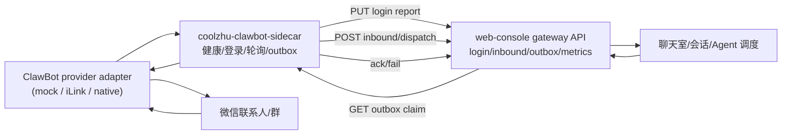

# 2026-07-03 ClawBot Provider Sidecar 设计规格

## 目标

阶段 4C 先落地可运行、可测试、可打包的 ClawBot provider sidecar 框架，让 coolzhu agent 能明确观察 sidecar 是否可用、登录生命周期是否推进、入站消息是否被安全转发、outbox 是否成功或失败回写。真实微信/iLink 协议细节保持在 sidecar provider adapter 内，不进入 web-console 巨型业务文件。

## 范围

本阶段包含：

- 新增 `coolzhu-clawbot-sidecar` 可执行 crate。
- sidecar 提供 HTTP 控制面：`/health`、`/version`、`/login/refresh`、`/login/logout`、`/login/status`、`/tick`。
- sidecar 通过 web-console 已有 gateway API 同步登录报告、入站消息和 outbox 发送结果。
- web-console 增加 sidecar 健康快照 API 与前端状态展示。
- package manifest 构建并发布 sidecar exe，安全扫描继续排除 `.coolzhu`、SQLite、token、cookie、模型会话配置。

本阶段不包含：

- 不内置真实微信 token/cookie。
- 不把 iLink/ClawBot SDK 私有凭据写入仓库。
- 不承诺真实扫码闭环；真实 provider adapter 在 4C-2 接入。
- 不让 ClawBot 绕过聊天室已有 Full Access 权限边界。

## 架构

web-console 仍是调度权威：幂等、递归防护、聊天室权限读取、模型调用和 outbox 重试状态都保留在 4B 已实现的 gateway store 内。sidecar 只负责 provider 生命周期和协议桥接。

## Provider 边界

sidecar 内定义 `ClawbotProvider` trait：

- `health()` 返回 provider 名称、版本、账号、是否在线、最后错误。
- `refresh_login()` 请求 provider 生成二维码或登录刷新。
- `logout()` 清理 provider 侧登录态。
- `poll_updates()` 拉取微信更新并转换为 `ClawbotInboundEnvelope`。
- `send_text()` 发送 outbox 文本，成功返回 provider message id，失败返回可见错误。

初版实现 `MockClawbotProvider`，可用环境变量或测试注入模拟登录、入站消息和发送失败，确保 sidecar 框架先可测。真实 iLink/ClawBot adapter 后续只替换 trait 实现。

## 错误与看护

- sidecar 不可用：web-console health API 返回 `available=false` 和具体错误，不吞掉。
- 入站递归：sidecar 发送入站时默认 `source=weixin_user`、`hop_count=0`；任何 provider echo 必须标记为 `gateway_echo` 或非零 hop，由 web-console 拒绝且不写 outbox。
- outbox 发送失败：sidecar 调用 `/outbox/{id}/fail`，web-console 负责三次重试和死信。
- sidecar claim 后崩溃：4B 的 30 秒租约回收继续生效。
- 登录 generation：sidecar 上报必须带当前 generation，旧报告不得覆盖新 refresh。

## 验收标准

1. `cargo test -p coolzhu-clawbot-sidecar --offline` 通过，覆盖 health、login report、inbound dispatch、outbox ack/fail。
2. `cargo build -p coolzhu-clawbot-sidecar --offline` 生成 sidecar exe。
3. web-console 暴露 sidecar health API；sidecar 不在时返回可见失败原因。
4. package manifest 包含 sidecar artifact；`scripts/test-package-manifest.ps1` 覆盖它。
5. package safety 测试确认 `.coolzhu`、SQLite、token/cookie/secret 不会入包。
6. work-log 记录真实微信扫码闭环仍待 4C-2 provider adapter 和外部凭据/设备验证。
