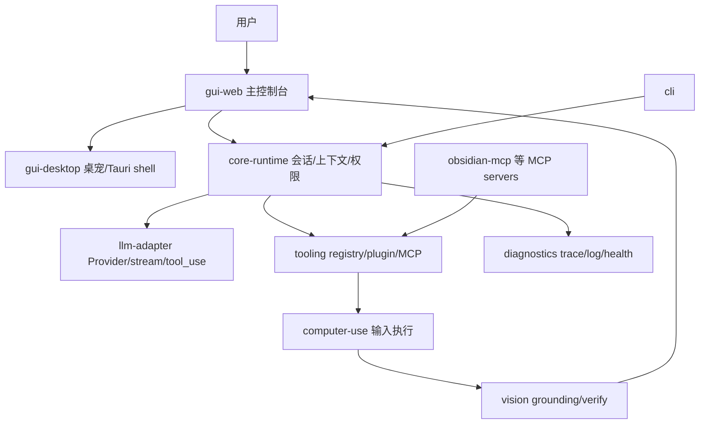

# 总体架构原理流程图

## 原理流程图

## 迁移摘要

- 主线从 Web GUI 进入 core-runtime，再按需调用 LLM、工具、视觉、Computer Use。
- Desktop 是用户可见壳与桌宠反馈，不应承载核心业务。
- Diagnostics 贯穿所有模块，提供 health、trace/span 和日志窗口。

## Obsidian 导航

- [[开发规范]]
- [[API接口]]
- [[需求管理表]]
- [[work-log]]
