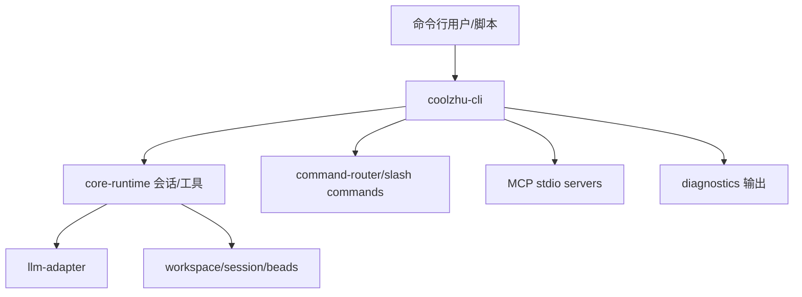

# CLI 原理流程图

## 原理流程图

## 迁移摘要

- 命令行入口，用于文本交互、调试、兼容命令和无 GUI 环境运行。
- CLI 当前完成度较低，主要作为 workspace package 和未来无 GUI 入口。
- MCP/CLI 方案建议短期复用 Web 终端面板与 runtime-execute，长期共享 agent core 消除漂移。
- 打包冻结期间 CLI 不作为安装包主线，但需要保留诊断和恢复命令设计。

## Obsidian 导航

- [[开发规范]]
- [[API接口]]
- [[需求管理表]]
- [[work-log]]
