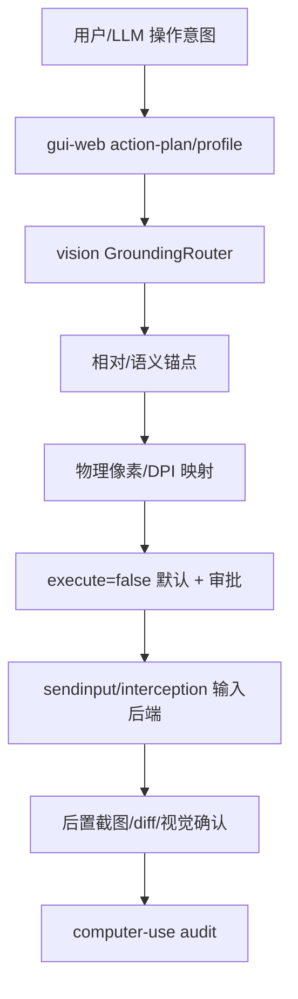

# Computer Use 原理流程图

## 原理流程图

## 迁移摘要

- 桌面操作闭环、分辨率矩阵、语义锚点、物理坐标映射、鼠标键盘输入和输入后端预检。
- 精准点击根治方案确认单 VLM 不可靠，系统控件优先走 UIA，内容区目标再走本地/远端 VLM。
- 已形成 profile/closed-loop/safe-click-test 等 Web 侧证据链；后续重点是更多真实应用矩阵和审计完整性。
- 2026-06-19 有 Computer Use 插件启动失败修复日志，需注意插件/后端路径与 MCP worker 并行改动。

## Obsidian 导航

- [[开发规范]]
- [[API接口]]
- [[需求管理表]]
- [[work-log]]
