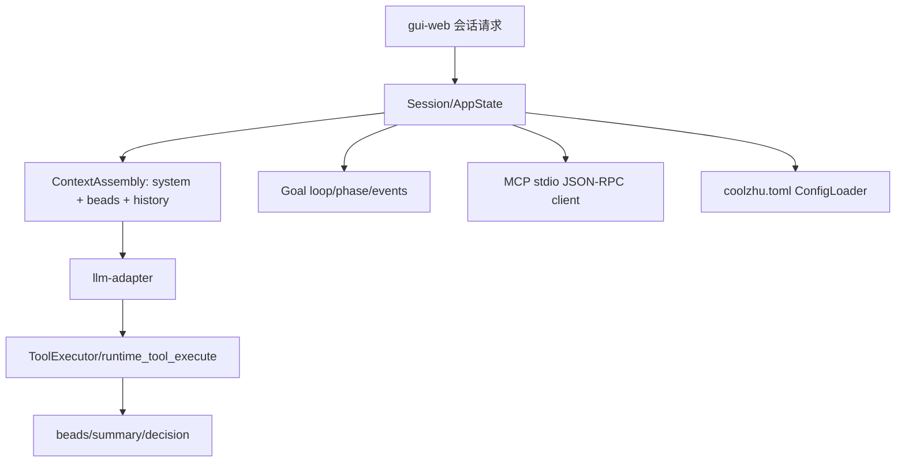

# Core Runtime 原理流程图

## 原理流程图

## 迁移摘要

- 会话、上下文、权限、配置、Agent 执行状态、MCP 客户端运行时和会话 HTTP 服务的业务核心。
- 上下文管理从固定窗口截断走向动态预算、compact 摘要和高价值 bead 沉淀。
- Goal、多 Agent、工具和视频异步链路都在向 core-runtime 收敛，需防止 web-console 巨型文件继续承载核心业务。
- 代码隐患审查排除了若干误判，真实次要隐患包括部分模型上下文容量登记偏小。

## Obsidian 导航

- [[开发规范]]
- [[API接口]]
- [[需求管理表]]
- [[work-log]]
