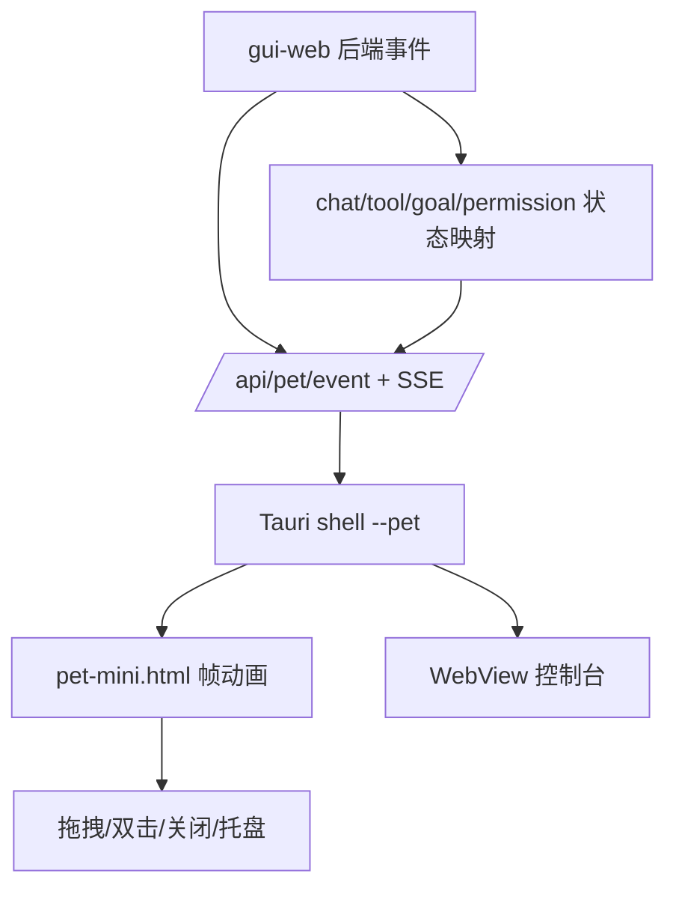

# GUI Desktop / 桌宠 原理流程图

## 原理流程图

## 迁移摘要

- Windows 桌面壳、Tauri WebView、透明置顶桌宠、托盘和桌面入口。
- clawd-on-desk 核心事件→状态→帧动画→悬浮窗链路已迁移，排除了多主题、多 CLI hooks、多 agent 追踪等不适用能力。
- 2026-06-03 落地过超人飞行和空闲表演；2026-06-16 最新口径已切换为银白金属 Q 版武侠侠客并替换旧动作。
- 桌宠文件拖放采用 HTML5 路径，原生 WM_DROPFILES 失败方案已废弃。

## Obsidian 导航

- [[开发规范]]
- [[API接口]]
- [[需求管理表]]
- [[work-log]]
