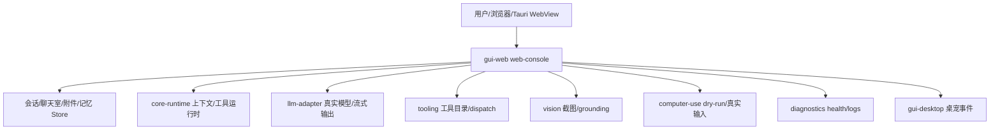

# GUI Web 控制台 原理流程图

## 原理流程图

## 迁移摘要

- Web 主控制台、聊天室、会话/记忆窗口、工具/视觉/诊断窗口和本地 HTTP API 聚合层。
- Web-GUI 从卡片主界面演进为多窗口工作台；工程、设置、聊天、任务、记忆、媒体、视觉、日志、浏览器和终端窗口已形成 D2 首版。
- 聊天室支持流式真实模型、附件、富文本、引用/转发和多 Agent handoff；下一步重点是视觉交互手感与跨模块回归。
- 最近 UI 迭代集中在 3D/舰桥/像素办公室视觉层和状态反馈，需防止装饰层污染 API 契约。

## Obsidian 导航

- [[开发规范]]
- [[API接口]]
- [[需求管理表]]
- [[work-log]]
