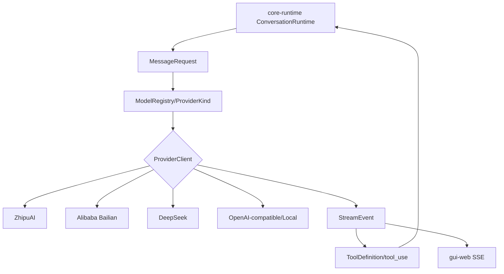

# LLM Adapter 原理流程图

## 原理流程图

## 迁移摘要

- 统一智谱、阿里、百度、字节、DeepSeek、OpenAI-compatible、本地模型等 provider 的请求、响应、流式事件和工具调用格式。
- 真实 provider、流式输出、reasoning effort、model_type、图文输入已可用，但自定义 OpenAI-compatible 表单和协议矩阵仍需收口。
- 上下文 compact 与模型能力表方案明确：根据模型 context window 动态预算，超长历史摘要化为 bead。
- 本地 Gemma/微调方案文档已沉淀，模型资源下载和训练不属于本次 vault 任务。

## Obsidian 导航

- [[开发规范]]
- [[API接口]]
- [[需求管理表]]
- [[work-log]]
