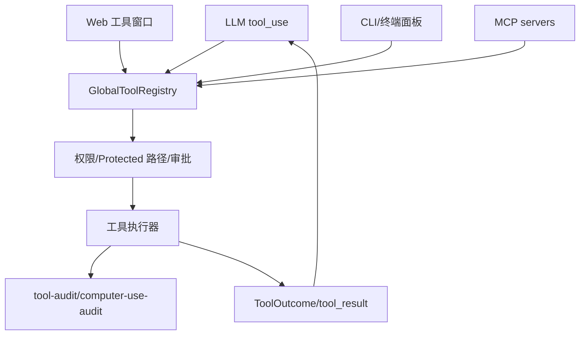

# Tooling / MCP / 插件 原理流程图

## 原理流程图

## 迁移摘要

- 工具注册、插件系统、slash command、兼容性抽取、MCP server 接入和 CLI Anything 工具扩展入口。
- 工具注册表已具备内置工具与插件基础，长期目标是 LLM/Web/CLI/MCP 都走 runtime_tool_execute。
- MCP/CLI 落地方案已定义 server connect/tools/call 路由；本次新增 Obsidian vault MCP 配置为项目级接入准备。
- MCP 预装总纲记录 obsidian-mcp 已做过连接自检，工具样例为 read_notes/search_notes。

## Obsidian 导航

- [[开发规范]]
- [[API接口]]
- [[需求管理表]]
- [[work-log]]
