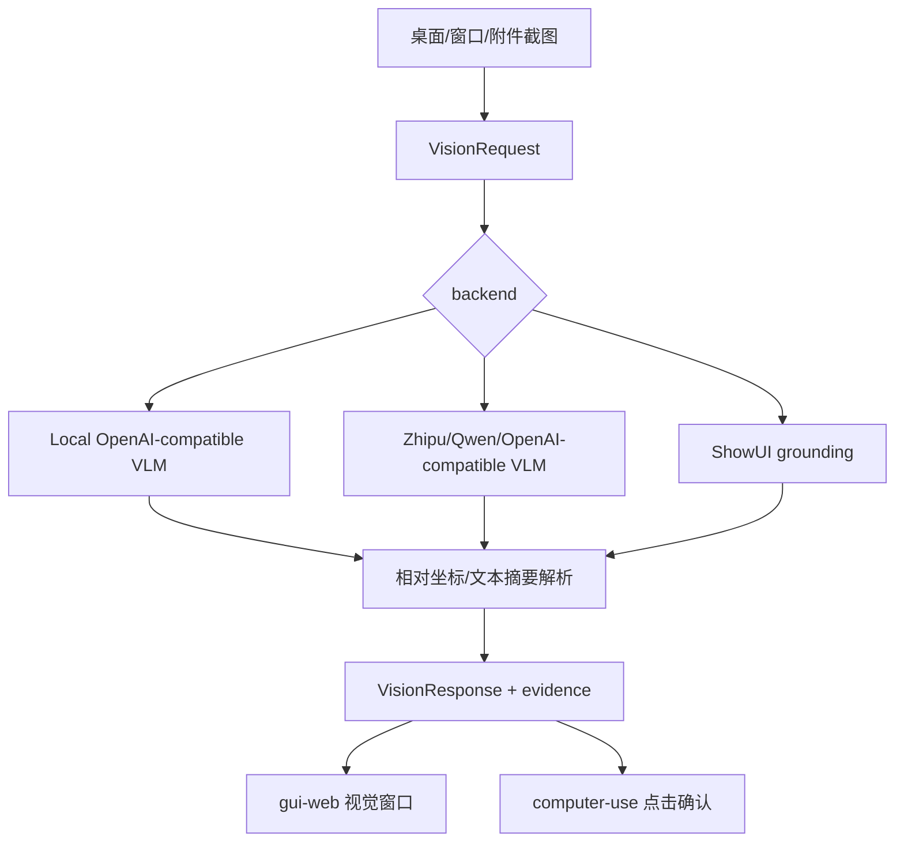

# Vision 原理流程图

## 原理流程图

## 迁移摘要

- 本地/远端 VLM、多模态请求、ShowUI grounding、视觉坐标解析和截图证据。
- 本地视觉栈已围绕 UI-DETR、ShowUI、Qwen/Gemma 等资源做多轮评估；8GB 显存限制要求本地资源按需拉起。
- 2026-06-08 推进了 agnes 理解层、误触发修复、视觉会话可配和实时视觉理解 API。
- 视觉语音实时链路已有大量验收截图与 recorder 证据，仍需避免“视觉理解请求误点桌面”。

## Obsidian 导航

- [[开发规范]]
- [[API接口]]
- [[需求管理表]]
- [[work-log]]
