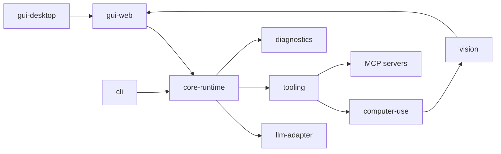

# modules 聚合原理流程图

## 原理流程图

## 迁移摘要

- `modules` 是一级目录，下面每个二级模块目录都有五类文档。
- 模块间依赖按“GUI 入口 → Core 编排 → Provider/Tool/Vision/Input/Diagnostics”收敛。

## Obsidian 导航

- [[开发规范]]
- [[API接口]]
- [[需求管理表]]
- [[work-log]]
