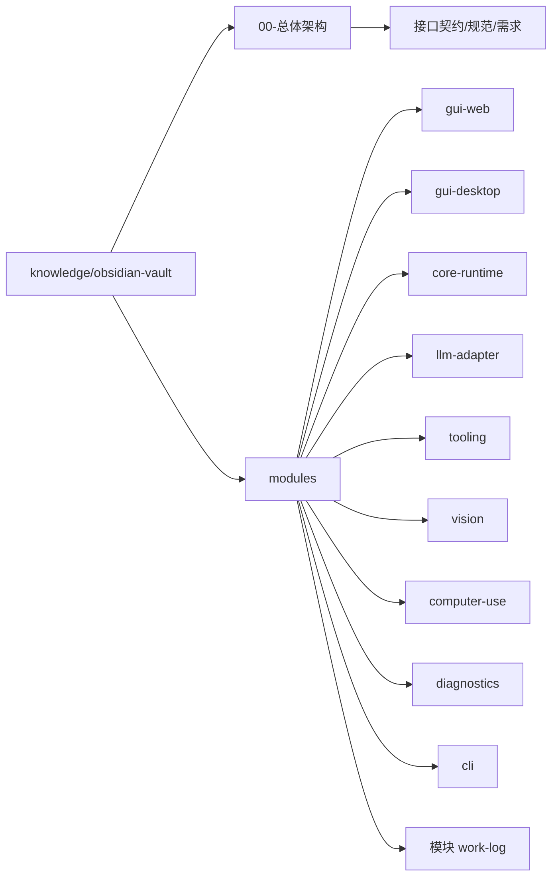

# COOLZHU 项目知识库总览

## 原理流程图

```mermaid
flowchart LR
  Vault[knowledge/obsidian-vault] --> Arch[00-总体架构]
  Vault --> Modules[modules]
  Modules --> Web[gui-web]
  Modules --> Desktop[gui-desktop]
  Modules --> Core[core-runtime]
  Modules --> LLM[llm-adapter]
  Modules --> Tooling[tooling]
  Modules --> Vision[vision]
  Modules --> CU[computer-use]
  Modules --> Diag[diagnostics]
  Modules --> CLI[cli]
  Arch --> Contracts[接口契约/规范/需求]
  Modules --> Worklog[模块 work-log]
```

## 迁移摘要

- vault 根目录是 Obsidian 的入口，不替代 `docs/` 原文档。
- 一级目录 `00-总体架构` 记录跨模块架构；`modules` 记录各模块五类文档。

## Obsidian 导航

- [[开发规范]]
- [[API接口]]
- [[需求管理表]]
- [[work-log]]
